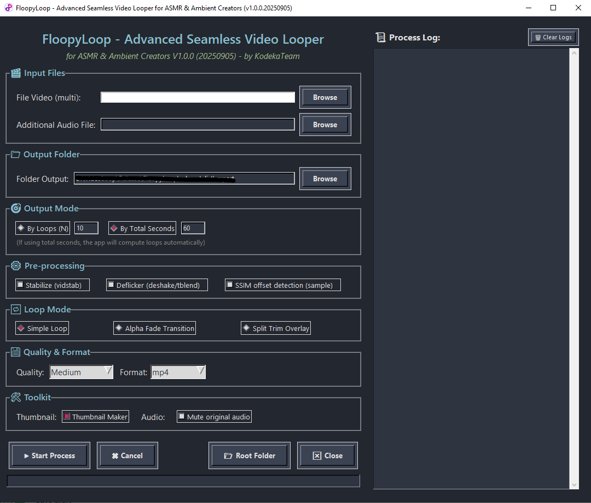

# FloopyLoop 

FloopyLoop adalah aplikasi yang dirancang untuk membantu kreator konten ASMR dalam membuat video looping dengan mudah. Dengan FloopyLoop, Anda dapat mengatur segmen video yang ingin diulang, menggabungkan beberapa loop, dan menghasilkan output video yang mulus.

## Fitur Utama

- **Looping Video Otomatis**: Pilih bagian video yang ingin diulang secara otomatis.
- **Penggabungan Segmen**: Gabungkan beberapa segmen loop menjadi satu video.
- **Antarmuka Sederhana**: Mudah digunakan tanpa perlu keahlian editing video.
- **Ekspor Video**: Simpan hasil looping dalam berbagai format video.

## Cara Penggunaan

1. Buka FloopyLoop.
2. Impor video yang ingin diedit.
3. Impor audio sebagai musik latar belakang.
4. Atur jumlah pengulangan by Loop atau by Seconds.
5. Start Process dan video akan di looping secara otomatis.
6. Tunggu hingga ada notifikasi bahwa proses looping telah selesai.

## Perhatian

- Jika ingin hasil audio lebih seamless, pastikan audio sudah loopable. Dan jika masih belum seamless, silahkan buat dulu di: [Audio Seamless](https://www.audjust.com/tools/ai-loop-audio)
- Selain itu, pastikan juga generate video yang cukup seamless/loopable sebelum menggunakan software ini.

## Kontribusi

Kontribusi sangat terbuka! Silakan buat diskusikan atau laporkan isu melalui halaman repository.

## Lisensi

FloopyLoop didistribusikan di bawah lisensi MIT.
