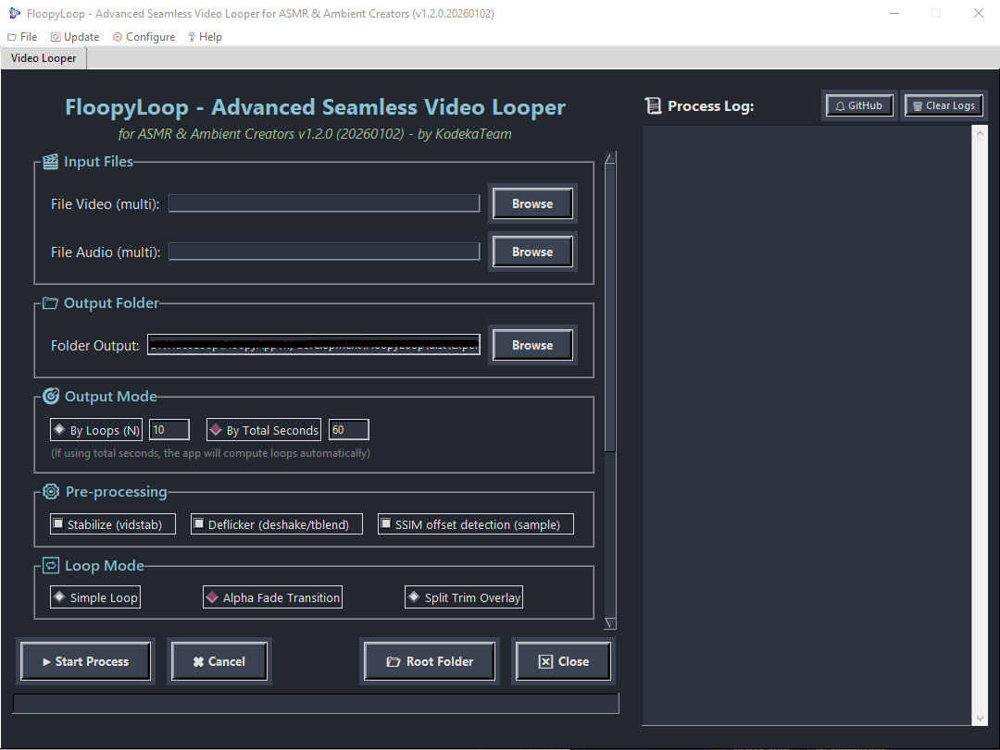

# FloopyLoop 

FloopyLoop adalah aplikasi desktop yang dirancang khusus untuk membantu kreator konten ASMR dalam membuat video looping dengan mudah dan efisien. Dengan antarmuka yang intuitif, FloopyLoop memungkinkan Anda untuk mengatur segmen video yang ingin diulang, menggabungkan beberapa loop, dan menghasilkan output video yang mulus tanpa memerlukan keahlian editing video tingkat lanjut.

## Fitur Utama

- **Looping Video Otomatis**: Pilih bagian video yang ingin diulang secara otomatis dengan presisi tinggi.
- **Penggabungan Segmen**: Gabungkan beberapa segmen loop menjadi satu video yang kohesif.
- **Antarmuka Sederhana**: Desain user-friendly yang mudah digunakan oleh pemula maupun profesional.
- **Ekspor Video**: Simpan hasil looping dalam berbagai format video populer.
- **Dukungan Audio**: Integrasi audio sebagai musik latar belakang untuk meningkatkan kualitas konten.
- **Pengaturan Fleksibel**: Atur jumlah pengulangan berdasarkan loop atau detik.

## Persyaratan Sistem

- **Sistem Operasi**: Windows 10 atau lebih baru.
- **Prosesor**: Intel Core i3 atau setara.
- **RAM**: Minimal 4 GB.
- **Penyimpanan**: 500 MB ruang kosong.
- **Dependensi**: FFmpeg (termasuk dalam instalasi).

## Memulai

1. Unduh file aplikasi dari [halaman release](https://github.com/KodekaTeam/FloopyApp/releases).
2. Jalankan aplikasi dan mulai gunakan.

Untuk pengembang yang ingin berkontribusi, lihat bagian [Kontribusi](#kontribusi).

## Cara Penggunaan

1. Buka aplikasi FloopyLoop.
2. Impor video yang ingin di looping melalui menu Import.
3. Impor audio sebagai musik utama dan musik latar belakang jika diperlukan.
4. Atur jumlah pengulangan berdasarkan loop atau detik menggunakan kontrol yang tersedia.
5. Klik "Start Process" untuk memulai proses looping otomatis.
6. Tunggu hingga notifikasi proses selesai muncul.
7. Buka dan mainkan video hasil looping.

### Tips untuk Hasil Optimal

- Pastikan video input sudah seamless/loopable untuk hasil terbaik.
- Untuk audio yang lebih seamless, gunakan alat seperti [Audio Seamless](https://www.audjust.com/tools/ai-loop-audio) sebelum memproses.

## Kontribusi

Kami sangat menghargai kontribusi dari komunitas! Untuk berkontribusi:

1. Fork repository ini.
2. Buat branch fitur baru (`git checkout -b feature/AmazingFeature`).
3. Commit perubahan Anda (`git commit -m 'Add some AmazingFeature'`).
4. Push ke branch (`git push origin feature/AmazingFeature`).
5. Buat Pull Request.

Silakan diskusikan ide atau laporkan isu melalui [halaman Issues](https://github.com/KodekaTeam/FloopyApp/issues).

## Changelog

### v1.1.5

- Perbaikan bug pada penggabungan segmen.
- Penambahan fitur baru.
- dll

### v1.1.0

- Perbaikan bug pada penggabungan segmen.
- Penambahan dukungan format video baru.

### v1.0.0

- Rilis awal dengan fitur looping dasar.

Lihat [halaman release](https://github.com/KodekaTeam/FloopyApp/releases) untuk changelog lengkap.

## Lisensi

FloopyLoop didistribusikan di bawah lisensi MIT. Lihat file [LICENSE](LICENSE) untuk detail lebih lanjut.

## Kontak

- **Pengembang**: KodekaTeam
- **Email**: -
- **Website**: -
- **GitHub**: [https://github.com/KodekaTeam/FloopyApp](https://github.com/KodekaTeam/FloopyApp)

---

_Dibuat dengan ❤️ oleh KodekaTeam untuk komunitas kreator ASMR Indonesia._
